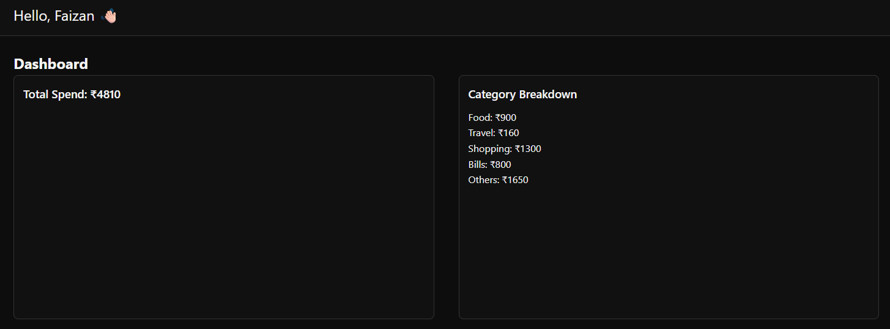

# Personal Expense Tracker

## Project Overview

A Personal Expense Tracker built with the MERN stack that allows users to log expenses, categorize them, and view a summary of spending. The project demonstrates full-stack development skills including REST API design, database modeling, React UI development, and SPA behavior.

This is a **monorepo** with separate frontend and backend folders:

- `/frontend` - React.js frontend
- `/backend` - Node.js + Express + MongoDB backend

---

## Project Setup

### Backend

1. Navigate to the backend folder:
   ```bash
   cd backend
   ```
2. Install dependencies:
   ```bash
   npm install
   ```
3. Create a `.env` file with the following variables:
   ```env
   PORT=5000
   MONGO_URI=your_mongodb_connection_string
   JWT_SECRET=your_jwt_secret
   ```
4. Start the backend server:
   ```bash
   npm run dev
   ```

### Frontend

1. Navigate to the frontend folder:
   ```bash
   cd frontend
   ```
2. Install dependencies:
   ```bash
   npm install
   ```
3. Start the frontend development server:
   ```bash
   npm run dev
   ```

> The frontend runs on `http://localhost:5173` and backend on `http://localhost:5000` (default).

---

## API Documentation

### Auth Routes (`/auth`)

| Method | Endpoint | Description                 | Protected |
| ------ | -------- | --------------------------- | --------- |
| POST   | /signup  | Register a new user         | No        |
| POST   | /login   | Login with email & password | No        |
| POST   | /user    | Get current user info       | Yes       |

**Request Body Example (Signup/Login):**

```json
{
  "name": "Faizan",
  "email": "faizan@example.com",
  "password": "yourpassword"
}
```

**Response Example:**

```json
{
  "token": "jwt_token_here",
  "user": {
    "name": "Faizan",
    "email": "faizan@example.com",
    "id": "user_id_here"
  }
}
```

### Expense Routes (`/expenses`)

| Method | Endpoint | Description                         | Protected |
| ------ | -------- | ----------------------------------- | --------- |
| POST   | /        | Create a new expense                | Yes       |
| GET    | /        | Get all expenses (supports filters) | Yes       |

**Query Parameters (Optional for GET):**

- `category` - Filter by category (Food, Travel, Shopping, Bills, Others)
- `from` - Start date (YYYY-MM-DD)
- `to` - End date (YYYY-MM-DD)

**Request Body Example (POST /expenses):**

```json
{
  "amount": 250,
  "category": "Food",
  "date": "2025-10-06",
  "notes": "Lunch at Zomato"
}
```

**Response Example (GET /expenses):**

```json
{
  "expenses": [
    {
      "amount": 250,
      "category": "Food",
      "date": "2025-10-06",
      "notes": "Lunch at Zomato",
      "id": "expense_id_here"
    }
  ]
}
```

**Summary Endpoint (Bonus):** `/summary` (GET)

- Returns total spending and category-wise breakdown

```json
{
  "total": 5000,
  "categories": {
    "Food": 2000,
    "Travel": 1500,
    "Shopping": 1000,
    "Bills": 500,
    "Others": 0
  }
}
```

---

## Screenshots to Include

1. **Login Page** - AuthForm with inputs and buttons
   
2. **Dashboard** - Total spend and category breakdown
   
3. **Pie Chart** - Visual representation of category-wise spending
   
4. **Add Expense Form** - Inputs for amount, category, date, and notes
   
5. **Expense List** - Table showing expenses with applied filters
   
6. **Filters Section** - Category dropdown and date range picker
   

---

## Other Info

- SPA behavior is implemented using React state and `fetch` API
- JWT authentication is used; token stored in `localStorage`
- Backend is connected to MongoDB (can use Atlas)
- Minimalistic black-themed UI with responsive layout

---

<br>

<p style="text-align: center">Thank You 💚</p>
